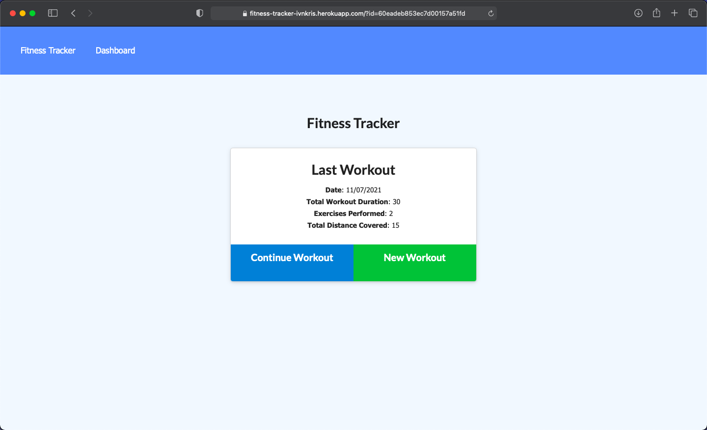
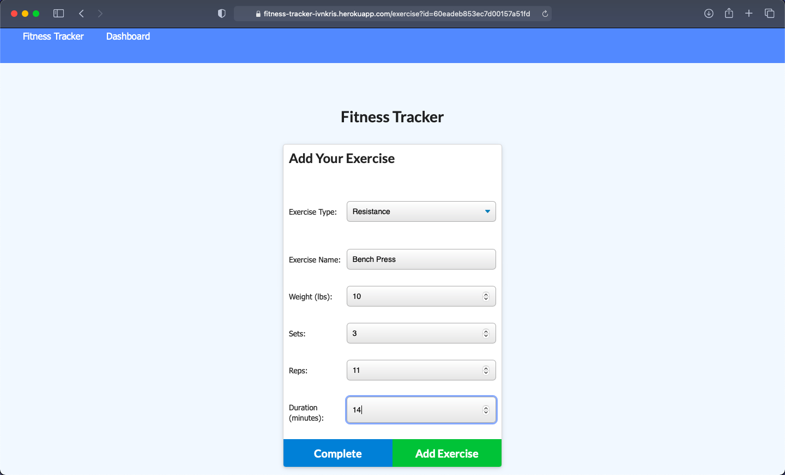
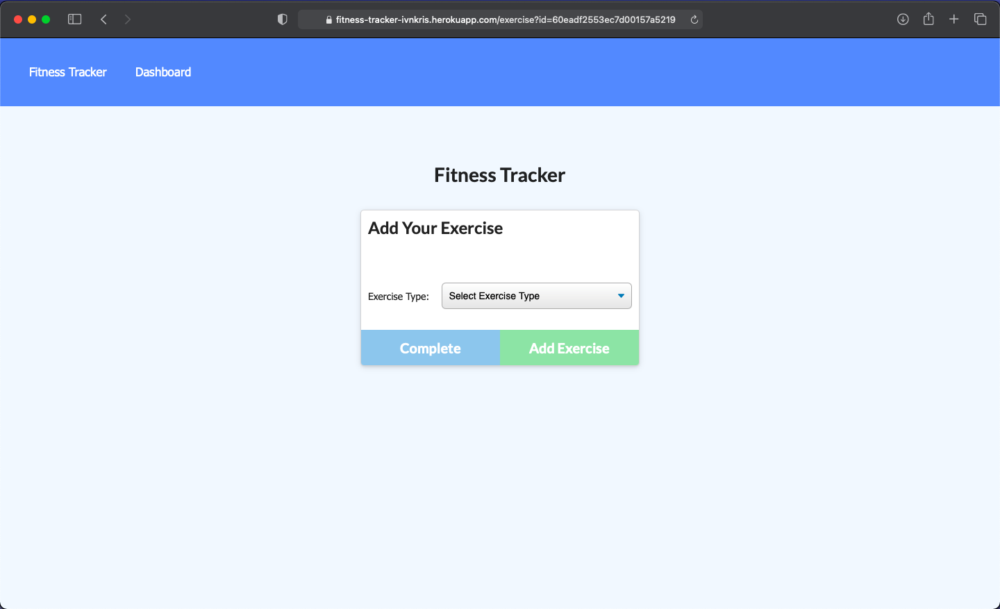
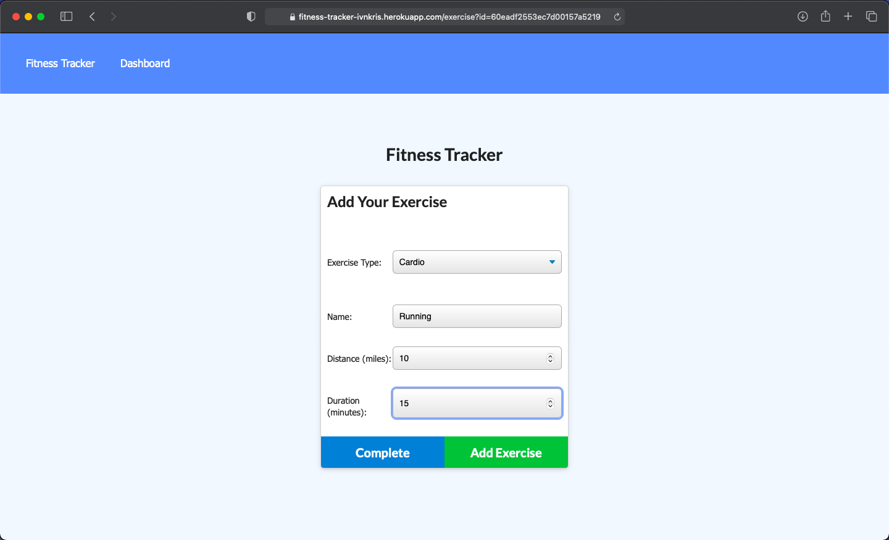
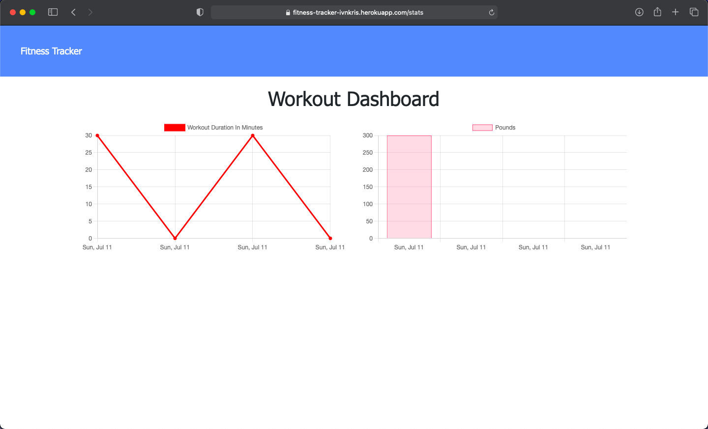

# Fitness Tracker

## Description

In this project I have created the backend for a fitness tracker application, using MongoDB as a database and mongoose as the ORM.

## What I have done

- [x] Created server using express.js
- [x] Created data model using mongoose
- [x] Created controllers to render and manipulate data
- [x] Created API and view routes

## Installation

```
git clone https://github.com/ivnkris/fitness-tracker
cd fitness-tracker
npm install
Set up and connect to MongoDB on your local machine
npm run seed
npm run start
```

## Contributing

Submit a pull request

## Scripts

```
npm run start
npm run seed
npm run dev
```

## Link to GitHub repository

https://github.com/ivnkris/fitness-tracker

## Link to deployed application

https://fitness-tracker-ivnkris.herokuapp.com/

## Screenshots







## Questions

- Send any questions via my [GitHub profile](https://github.com/ivnkris)
